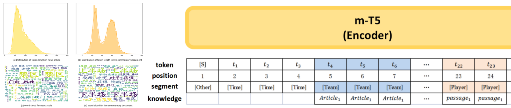
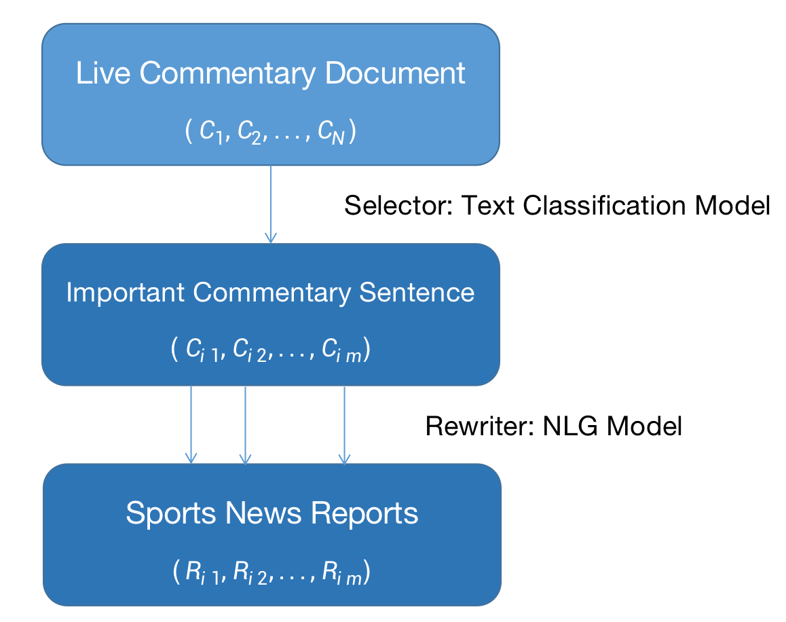

# Knowledge Enhanced Sports Game Summarization
<p align="center">
    <br>
    
    <br>
</p>

This repository contains data and code for the WSDM 2022 paper [*Knowledge Enhanced Sports Game Summarization*](https://arxiv.org/abs/2111.12535).

In this work, we propose K-SportsSum dataset as well as the KES model.   
- K-SportsSum: It has 7854 sports game summarization samples together with a large-scale knowledge corpus containing information of 523 sports teams and 14k+ sports players.
- KES: a NEW sports game summarization model based on mT5.


### 1. K-SportsSum Dataset
Data will be released after approval process.（Before the Spring Festival） 

### 2. Baseline Model Construction
<p align="center">
    <br>
    
    <br>
</p>

In this Section, we introduce how to build a two-step baseline system for Sports Game Summarization. As shown in the above Figure, the baseline framework first selects important commentary sentences from original live commentary documents through a text classification model. `Ck` represents each commentary sentence and `Cik` denotes each selected important sentence. Further, we should convert each selected sentence to a news-style sentence through a generative model. `Rik` is the generated sentence corresponding to `Cik`.

#### 2.1 Selector
The selector is a text classification model. In our work, we resort to the following toolkits:
- [Chinese-Text-Classification-Pytorch](https://github.com/649453932/Chinese-Text-Classification-Pytorch): This toolkit includes multiple codes (both training and inference) of text classification model before BERT era, such as TextCNN.
- [Bert-Chinese-Text-Classification-Pytorch](https://github.com/649453932/Bert-Chinese-Text-Classification-Pytorch): This toolkit contains text classification codes after BERT era, e.g., BERT, ERNIE.  

These two toolkits are very useful for buiding a Chinese text classification system.

#### 2.2 Rewriter
The rewriter is a generative model. Existing works typically employ [PTGen (See, ACL 2017)](https://arxiv.org/abs/1704.04368), mBART, mT5 et al.

For PTGen, the [pointer_summarizer](https://github.com/atulkum/pointer_summarizer) toolkit is widely used. I also recommend the [implementation](https://github.com/xcfcode/PLM_annotator/tree/main/pgn) released by Xiachong Feng in his dialogue summarization work. Both of implementations are convenient. Please note that if u choose to use PTGen as rewriter, you should select a pre-trained word embedding to help model achieve great performance ([Chinese-Word-Vectors](https://github.com/Embedding/Chinese-Word-Vectors) is helpful).

For mBART, mT5 et al. We use the implementations of [Huggingface Transformers Library](https://huggingface.co/docs/transformers/index). I release the corresponding training and inference codes for public use (See `rewriter.py`, `mBART-50` is used as rewriter in this code).     
Requirements: pytorch-lighting 0.8.5; transformers >= 4.4; torch >= 1.7    
(This code is based on the [Longformer code](https://github.com/allenai/longformer/blob/master/scripts/summarization.py) from AI2.)

For training, you can run commands like this:
```sh
python rewriter.py --device_id 0
```
For evaluation, the command may like this:
```sh
python rewriter.py --device_id 0 --test
```
Note that, if u want to inference with a trained model, remember to initialize the model with corresponding `.ckpt` file.

#### 2.3 Construct Training Samples for Selector and Rewriter
In order to construct training samples for selector and rewriter, we should map each new sentence to corresponding commentary sentence, if possible. (If u do not understand it, please see more details in Section3.1 of [SportsSum2.0](https://arxiv.org/abs/2110.05750)).

Thus, the core content of this process is calculating the ROUGE scores and BERTScore given two Chinese sentences.   
- ROUGE: you can use [multilingual_rouge_scoring](https://github.com/csebuetnlp/xl-sum/tree/master/multilingual_rouge_scoring) toolkit to calculate the Chinese ROUGE Scores. Note that, the [py-rouge](https://github.com/Diego999/py-rouge) and [rouge](https://github.com/pltrdy/rouge) toolkits are not suitable for Chinese.
- BERTScore: Please find more details in [bert_score](https://github.com/Tiiiger/bert_score).

### 3. KES model
Code will be published once the author of this repo has time. （Around conference date of WSDM'22）

### 4. Existing Works
To facilitate researchers to efficiently comprehend and follow the Sports Game Summarization task, we write a Chinese survey post: [《体育赛事摘要任务概览》](https://mp.weixin.qq.com/s/EidRYB_80AhRclz-mryVhQ), where we also discuss some future directions and give our thoughts.

We list and classify existing works of Sports Game Summarization:

| Paper | Conference/Journal | Data/Code | Category |
| :--: | :--: | :--: | :--: |
| [Towards Constructing Sports News from Live Text Commentary](https://aclanthology.org/P16-1129) | ACL 2016 | - | `Dataset`, `Ext.` |
| [Overview of the NLPCC-ICCPOL 2016 Shared Task: Sports News Generation from Live Webcast Scripts](https://link.springer.com/chapter/10.1007%2F978-3-319-50496-4_80) | NLPCC 2016 | [NLPCC 2016 shared task](http://tcci.ccf.org.cn/conference/2016/pages/page05_CFPTasks.html) | `Dataset` |
| [Research on Summary Sentences Extraction Oriented to Live Sports Text](https://link.springer.com/chapter/10.1007%2F978-3-319-50496-4_72) | NLPCC 2016 | - | `Ext.` |
| [Sports News Generation from Live Webcast Scripts Based on Rules and Templates](https://link.springer.com/chapter/10.1007%2F978-3-319-50496-4_81) | NLPCC 2016 | - | `Ext.+Temp.` |
| [Content Selection for Real-time Sports News Construction from Commentary Texts](https://aclanthology.org/W17-3504/) | INLG 2017 | - | `Ext.` |
| [Generate Football News from Live Webcast Scripts Based on Character-CNN with Five Strokes](http://csroc.org.tw/journal/JOC31-1/JOC3101-21.pdf) | 2020 | - | `Ext.+Temp.` |
| [Generating Sports News from Live Commentary: A Chinese Dataset for Sports Game Summarization](https://aclanthology.org/2020.aacl-main.61/) | AACL 2020 | [SportsSum](https://github.com/ej0cl6/SportsSum) | `Dataset`, `Ext.+Abs.` |
| [SportsSum2.0: Generating High-Quality Sports News from Live Text Commentary](https://arxiv.org/abs/2110.05750) | CIKM 2021 | [SportsSum2.0](https://github.com/krystalan/SportsSum2.0) | `Dataset`, `Ext.+Abs.` |
| [Knowledge Enhanced Sports Game Summarization](https://arxiv.org/abs/2111.12535) | WSDM 2022 | [K-SportsSum](https://github.com/krystalan/K-SportsSum) | `Dataset`, `Ext.+Abs.` |

The concepts used in Category are illustrated as follows:  
- `Dataset`: The work contributes a dataset for sports game summarization.
- `Ext.`: Extractive sports game summarization method.
- `Ext.+Temp.`: The method first extracts important commentary sentence and further utilize the human-labeled template to convey each commentary sentence to a news sentence.
- `Ext.+Abs.`: The method first extracts important commentary sentence and further utilize the seq2seq model to convey each commentary sentence to the news sentence.

### Q&A
Q1: What the differences among SportsSum, SportsSum2.0, SGSum and K-SportsSum?   
A1: **SportsSum (Huang et al. AACL 2020)** is the first large-scale Sports Game Summarization dataset which has 5428 samples. Though its wonderful contribution, the SportsSum dataset has about 15% noisy samples. Thus, **SportsSum2.0 (Wang et al, CIKM 2021)** cleans the original SportsSum and obtains 5402 samples (26 bad samples in SportsSum are removed). Following previous works, **SGSum (Non-Archival Paper, 未正式发表)** collects and cleans a large amount of data from massive games. It has 7854 samples. **K-SportsSum (Wang et al. WSDM 2022)** shuffle and randomly divide the **SGSum**. Furthermore, **K-SportsSum** has a large-scale knowledge corpus about sports teams and players, which could be useful for alleviating the knowledge gap issue (See K-SportsSum paper).

Q2: There is less code about sports game summarization.     
A2: Yeah, I know that. All existing works follow the pipeline paradigm to build sports game summarization systems. They may have two or three steps together with a pseudo label construction process. Thus, the code is too messy. For the solution, we 1) release a tutorial for building a two-step baseline for Sports Game Summarization (See Section2 in this page); 2) build an end-to-end model for public use (Work in progress, maybe will be published in 2022, but there is no guarantee. If you have experience of publishing NLP (especially NLG) papers and want to do this work with me, please feel free to write an email to me, jawang1[at]suda.edu.cn).  

Q3: About position embedding in mT5.    
A3: Position embedding of mT5 is set to zero vector since it uses relative position embeddings in self-attention.

Q4: Any questions and suggestions?    
A4: Please feel free to contact me (jawang1[at]suda.edu.cn).

### Acknowledgement
Jiaan Wang would like to thank **[KW Lab, Fudan Univ.](http://kw.fudan.edu.cn/)** and **[iFLYTEK AI Research, Suzhou](https://www.iflytek.com/index.html)** for their helpful discussions and GPU device support.

### Citation
If you find this project is useful or use the data in your work, please consider cite our paper:
```
@article{Wang2021KnowledgeES,
  title={Knowledge Enhanced Sports Game Summarization},
  author={Jiaan Wang and Zhixu Li and Tingyi Zhang and Duo Zheng and Jianfeng Qu and An Liu and Lei Zhao and Zhigang Chen},
  journal={ArXiv},
  year={2021},
  volume={abs/2111.12535}
}
```
